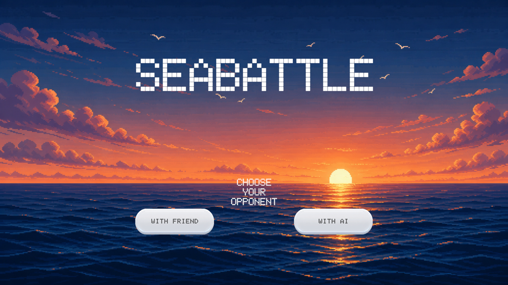
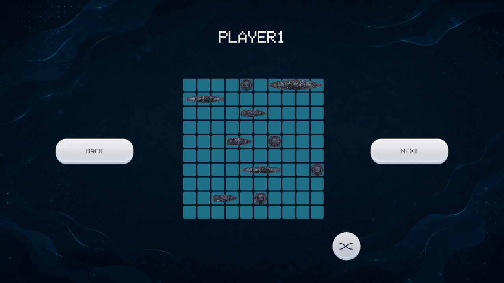
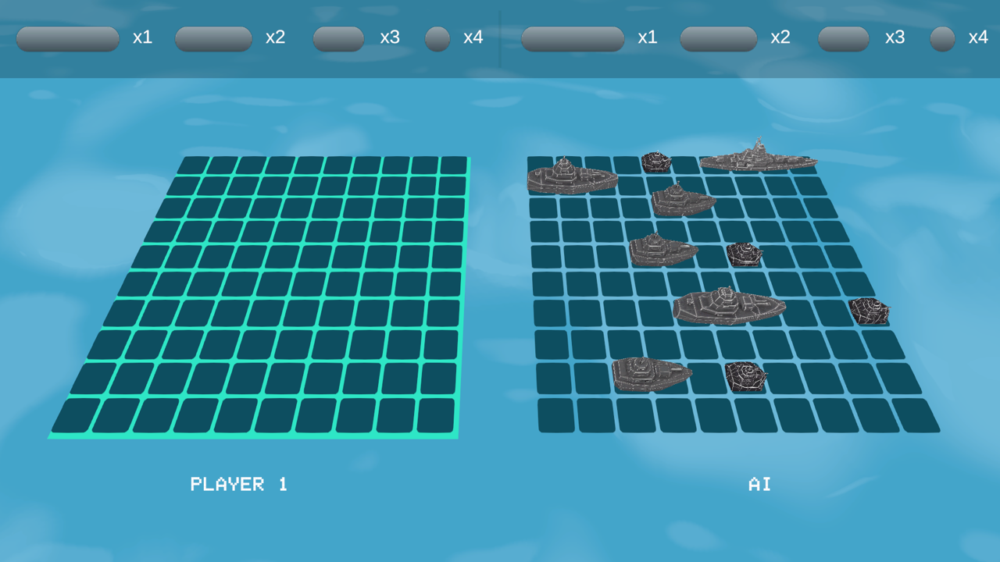
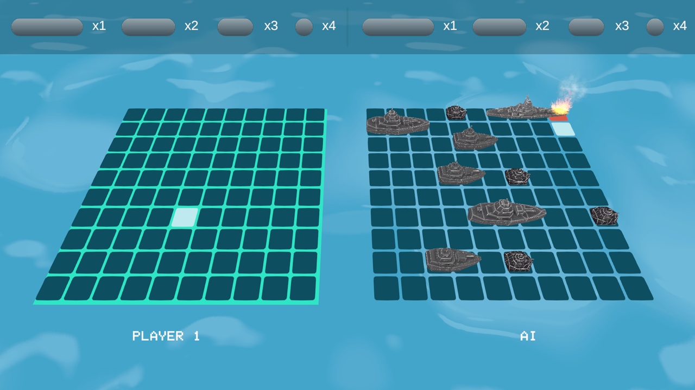
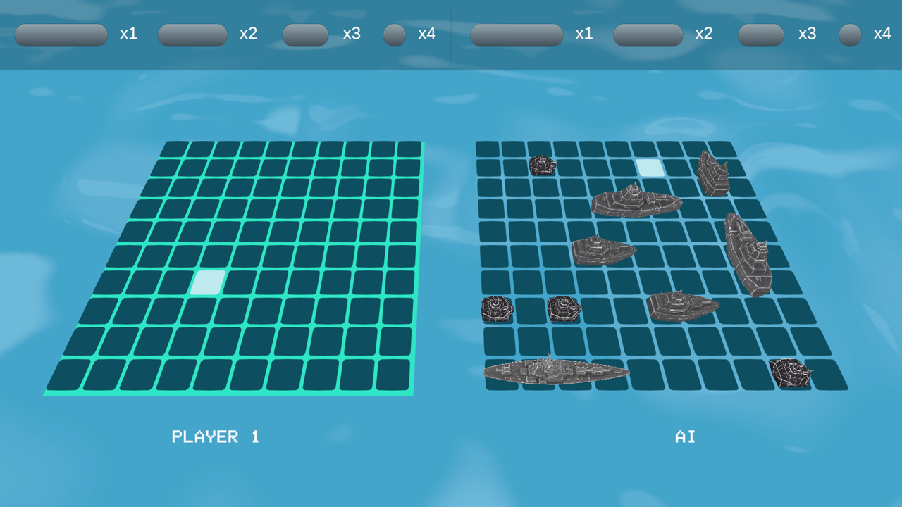

<div align="center">



<br>


**≈≈≈ Морской бой в 2.5D. Наведи орудия. Потопи флот. ≈≈≈**

</div>

<br>

> **БОЕВОЕ ДОНЕСЕНИЕ**
> Классический «Морской бой», переизданный в 2.5D: два флота на наклонных сетках, снаряды прилетают из-за горизонта, попадания взрываются огнём и дымом, а промахи тонут с тихим всплеском. Играй с другом за одним экраном — или бросай вызов корабельному ИИ.

<br>

## 📡 Разведданные (скриншоты)

<table>
<tr>
<td width="50%">

**Главное меню**


</td>
<td width="50%">

**Расстановка флота**


</td>
</tr>
<tr>
<td width="50%">

**Морской бой**


</td>
<td width="50%">

**Прямое попадание**


</td>
</tr>
</table>

<div align="center">

<br><sub>Промах — снаряд уходит в воду</sub>
</div>

<br>

## ⚓ Тактико-технические характеристики

| | |
|---|---|
| 🎮 **Режим «С другом»** | Хот-сит на одном устройстве: игроки поочерёдно расставляют флот и делают ходы |
| 🤖 **Режим «С ИИ»** | Игрок расставляет корабли сам, ИИ разворачивает и наводит огонь автоматически |
| 🧩 **Расстановка** | Ручное перетаскивание/вращение кораблей или мгновенная авторасстановка одной кнопкой |
| 🚀 **Огонь** | Снаряд анимированно летит из-за экрана к выбранной клетке |
| 💥 **Попадание** | Взрыв, огонь и дым на подбитом отсеке корабля |
| 🌊 **Промах** | Всплеск воды в точке падения снаряда |
| 📊 **Учёт флота** | Счётчики уцелевших кораблей (1×/2×/3×/4×-палубные) в реальном времени для обеих сторон |
| 🏆 **Победа** | Экран победителя с анимацией и кнопкой мгновенного реванша (**Restart**) |

<br>

## 🗺️ Карта операции (архитектура)

Игровая логика отделена от Unity-слоя по схеме **Model → Controller → Presenter → View** — правила боя тестируемы и не зависят от `MonoBehaviour`.

<details>
<summary><b>Развернуть структуру <code>Assets/Scripts</code></b></summary>

```
Assets/Scripts
├── Model/
│   ├── Models/          Sea, Sector, Ship, Fleet
│   │                     — чистые игровые данные, без зависимостей от Unity
│   └── Controllers/     Staff, Commander, PlansOfficer, Assignee,
│                         TurnRecon, BattleController, HomingWeapon
│                         — игровые правила и наведение ИИ
│
├── Presenter/           BattlePresenter, AiBattlePresenter,
│                         DeployPresenter, SwitchPresenter
│                         — мост между моделью и сценой
│
└── View/
    ├── BattleView/       BoardView, SectorView, ShipBattle
    │                      — 3D-представление поля боя
    ├── DeployView/        DeployBoard, DeploySector, DeployShip, MessagePanel
    ├── Animation/         DOTween: интро, кнопки, снаряды, победа
    └── GameSession, GameMode, GameUI, MusicPlayer, Restart, WinnerView
```

</details>

**Курс похода (сцены):**

`Intro` → `StartScene` → `DeployScene` → `BattleScene 1` → `WinnerScene`

<br>

## 🔧 Боекомплект (технологии)

| Компонент | Назначение |
|---|---|
| **Unity 6** `6000.4.11f1` | Движок, Universal Render Pipeline (URP) |
| **Input System** | Обработка ввода нового поколения |
| **DOTween** | Анимации интерфейса, снарядов, переходов между экранами |
| **TextMesh Pro** | Весь текст интерфейса |
| Кастомный шейдер моря (`Assets/E_Water`, `Assets/Shader`) | Анимированный океан на фоне |
| Particle System | Огонь, дым, искры, всплески |

<br>

## 🚀 Развёртывание

```bash
# 1. Клонировать репозиторий
git clone https://github.com/yvi7693/SeaBattle-2026-06-14_12-51-42.git

# 2. Открыть Unity Hub → Add → указать папку проекта
```

1. Установите [Unity Hub](https://unity.com/download) и Unity **6000.4.11f1** (или совместимую Unity 6).
2. Откройте проект через Unity Hub.
3. Дождитесь импорта ассетов и откройте сцену `Assets/Scenes/Intro.unity`.
4. Нажмите **▶ Play** — начнётся интро и главное меню.

Для сборки билда сцены уже выставлены в `Build Settings` в боевом порядке (`Intro → StartScene → DeployScene → BattleScene 1 → WinnerScene`).

<br>

## 🕹️ Управление огнём

| Действие | Клавиша/жест |
|---|---|
| Выбрать клетку / кнопку интерфейса | Клик мышью |
| Автоматическая расстановка флота | Кнопка **⤫** на экране расстановки |
| Вернуться на предыдущий экран | Кнопка **Back** |
| Начать бой заново | Кнопка **Restart** на экране победителя |

<br>

<div align="center">

**≈≈≈≈≈≈≈≈≈≈≈≈≈≈≈≈≈≈≈≈≈≈≈≈≈≈≈≈≈≈≈≈≈≈≈≈≈≈≈≈≈≈≈≈≈≈≈≈≈≈≈≈≈≈≈≈≈≈**

*Занять позиции. Открыть огонь. Потопить врага.*

**≈≈≈≈≈≈≈≈≈≈≈≈≈≈≈≈≈≈≈≈≈≈≈≈≈≈≈≈≈≈≈≈≈≈≈≈≈≈≈≈≈≈≈≈≈≈≈≈≈≈≈≈≈≈≈≈≈≈**

</div>
