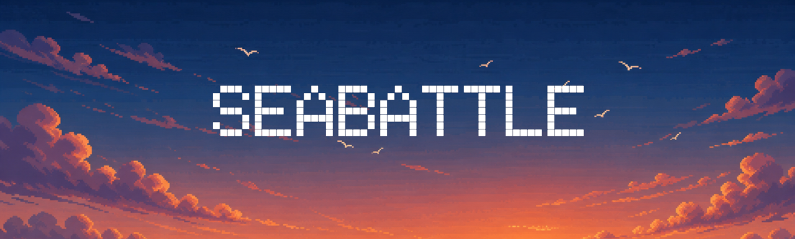
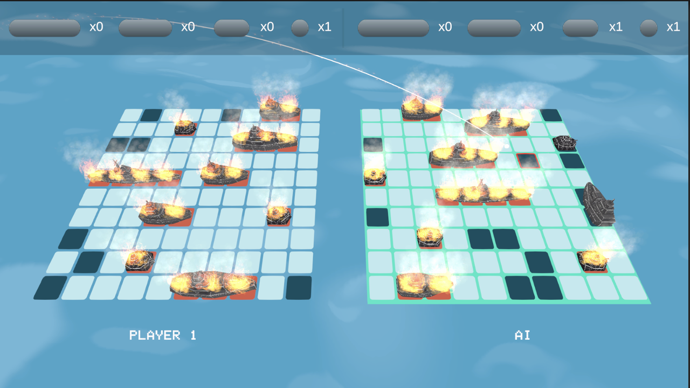
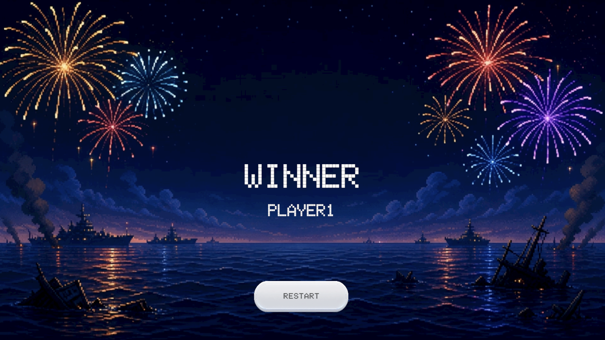
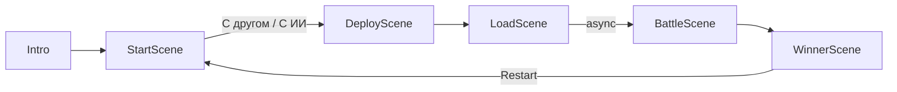

<div align="center">



<br>
<br>


<br>
<br>

**Классический «Морской бой» в 2.5D — на Unity 6, с чистой игровой моделью и ИИ-противником.**

[**Скачать и играть**](#-скачать-и-играть) · [Архитектура](#-архитектура) · [ИИ противника](#-ии-противника) · [Тесты](#-тестирование) · [Сборка](#-сборка-из-исходников)

</div>

---

## О проекте

Два флота на наклонных 3D-сетках, снаряды прилетают из-за горизонта, попадания взрываются огнём и дымом, промахи тонут с всплеском. После каждого выстрела на поле появляется персонаж стреляющей стороны и комментирует результат. Играть можно вдвоём за одним экраном или против корабельного ИИ.

Технически это не только игра, но и попытка ответить на вопрос: **насколько далеко можно увести игровые правила от `MonoBehaviour`?** Вся боевая логика — расстановка, валидация, выстрелы, добивание, определение победителя — живёт в обычных C#-классах без единой ссылки на UnityEngine и покрыта 234 модульными тестами. Unity-слой отвечает только за отрисовку и ввод.

<div align="center">

| | |
|:---|:---|
| **Строк игровой логики** | ~40 C#-классов в 4 слоях |
| **Модульных тестов** | 234 (NUnit, без Unity-зависимостей) |
| **Unity-зависимостей в модели** | 0 |
| **Сцен** | 6, полный игровой цикл с рестартом |

</div>

<br>

## 📥 Скачать и играть

<div align="center">

[](https://github.com/yvi7693/SeaBattle/releases/latest)

Готовая сборка для **macOS** и **Windows** — Unity ставить не нужно.

</div>

<br>

## ⚓ Что умеет игра

| | |
|---|---|
| 🎮 **Режим «С другом»** | Хот-сит на одном устройстве: игроки поочерёдно расставляют флот и делают ходы |
| 🤖 **Режим «С ИИ»** | Игрок расставляет корабли сам, ИИ разворачивает флот и наводит огонь автоматически |
| 🧩 **Расстановка** | Перетаскивание и вращение кораблей мышью или мгновенная авторасстановка одной кнопкой |
| ✅ **Валидация флота** | Корабли не могут пересекаться и касаться друг друга — правила проверяются в модели, а не в UI |
| 🎯 **Подсветка секторов** | Клетка под курсором подсвечивается — видно, куда уйдёт снаряд |
| 🚀 **Огонь** | Снаряд анимированно летит из-за экрана к выбранной клетке |
| 💥 **Попадание** | Взрыв, огонь и дым на подбитом отсеке; ход остаётся у стрелявшего |
| 🌊 **Промах** | Всплеск воды и передача хода противнику |
| 🚢 **Добивание** | При уничтожении корабля вся акватория вокруг него автоматически помечается как пустая |
| 📊 **Учёт флота** | Счётчики уцелевших 1/2/3/4-палубных кораблей в реальном времени для обеих сторон |
| 💬 **Реплики персонажей** | После выстрела персонаж появляется с портретом и случайной фразой — своя на попадание, своя на промах |
| 🏆 **Победа** | Отдельная сцена победителя с анимацией и кнопкой мгновенного реванша |

<br>

<details>
<summary><b>📸 Скриншоты</b></summary>

<br>

<table>
<tr>
<td width="50%"><br><sub>Главное меню</sub></td>
<td width="50%"><br><sub>Расстановка флота</sub></td>
</tr>
<tr>
<td width="50%"><br><sub>Морской бой</sub></td>
<td width="50%"><br><sub>Прямое попадание</sub></td>
</tr>
<tr>
<td width="50%"><br><sub>Промах — снаряд уходит в воду</sub></td>
<td width="50%"><br><sub>Концовка партии против ИИ — снаряд в полёте</sub></td>
</tr>
<tr>
<td width="50%"><br><sub>Экран победителя</sub></td>
<td width="50%"></td>
</tr>
</table>

</details>

<br>

## 🗺️ Архитектура

Проект построен по схеме **Model → Controller → Presenter → View**. Ключевое правило: `Assets/Scripts/Model` не знает про Unity вообще — там нет ни `using UnityEngine`, ни наследования от `MonoBehaviour`. Благодаря этому правила боя запускаются и тестируются без Editor и Play Mode.

```
┌──────────────────────────────────────────────────────────┐
│  View          MonoBehaviour: клики, 3D-сетки, анимации  │
│                BoardView · SectorView · DeployBoard      │
└────────────────────────┬─────────────────────────────────┘
                         │  события ввода / команды отрисовки
┌────────────────────────┴─────────────────────────────────┐
│  Presenter     мост Unity ⇄ модель                       │
│                BattlePresenter · AiBattlePresenter       │
│                DeployPresenter · SwitchPresenter         │
└────────────────────────┬─────────────────────────────────┘
                         │  TacticalDirective(x, y) → MissionResult
┌────────────────────────┴─────────────────────────────────┐
│  Controller    правила боя, чистый C#                    │
│                Staff → Commander → PlansOfficer          │
│                     → Assignee → TurnRecon               │
│                BattleController · HomingWeapon           │
└────────────────────────┬─────────────────────────────────┘
                         │
┌────────────────────────┴─────────────────────────────────┐
│  Model         данные, чистый C#                         │
│                Sea · Sector · Ship · Fleet               │
└──────────────────────────────────────────────────────────┘
```

### Как проходит один выстрел

`Staff` — единственная точка входа в модель. Presenter вызывает `TacticalDirective(x, y)` и получает обратно `MissionResult`, по которому решает, что проиграть на сцене:

```csharp
MissionResult result = staff.TacticalDirective(x, y);

// Hit            → взрыв, ход остаётся у стрелявшего
// Miss           → всплеск, TurnRecon уже переключил цель на другое море
// HaveWinner     → переход на WinnerScene
// UnsucessfulShot→ клетка уже обстреляна, ход не засчитан
```

Внутри цепочка ответственностей выстроена как штаб корабля — каждый класс делает ровно одно:

| Класс | Зона ответственности |
|---|---|
| `Staff` | Фасад модели: собирает граф зависимостей и отдаёт наружу две команды — расстановка и выстрел |
| `Commander` | Оркестрация хода: разрешение → атака → проверка победы → передача хода |
| `PlansOfficer` | Валидация приказа: существует ли клетка, не обстреляна ли уже, корректна ли расстановка |
| `Assignee` | Исполнение: меняет статус сектора, наносит урон кораблю, топит его |
| `TurnRecon` | Чьё море сейчас атакующее, а чьё — целевое |
| `BattleController` | Состояние партии: два флота, поиск корабля по палубности, объявление победителя |
| `DeploymentOfficer` | Геометрия расстановки: пересечения, касания, нормализация координат |
| `AttackResolver` / `Sinker` | Разрешение попадания и затопление корабля с обводкой соседних клеток |

<details>
<summary><b>Развернуть структуру <code>Assets/Scripts</code></b></summary>

```
Assets/Scripts
├── GameAssembly.asmdef      отдельная сборка игровой логики
│
├── Model/
│   ├── Models/              Sea, Sector, Ship, Fleet
│   │                        — чистые игровые данные
│   └── Controllers/         Staff, Commander, PlansOfficer, Assignee,
│                            TurnRecon, BattleController, HomingWeapon,
│                            Services (DeploymentOfficer, AttackResolver, Sinker)
│                            — правила боя и наведение ИИ
│
├── Presenter/               BattlePresenter, AiBattlePresenter,
│                            DeployPresenter, SwitchPresenter
│
└── View/
    ├── BattleView/          BoardView, SectorView, ShipBattle
    ├── DeployView/          DeployBoard, DeploySector, DeployShip, MessagePanel
    ├── Animation/           DOTween: интро, кнопки, снаряды, загрузка, победа
    │                        + CommentaryView — выезд портрета с репликой
    ├── Person.cs            ScriptableObject: иконка + списки фраз на хит/промах
    └── GameSession, GameMode, GameUI, MusicPlayer, Restart, WinnerView
```

</details>

### Курс похода (сцены)



`LoadScene` подгружает боевую сцену через `LoadSceneAsync`, чтобы переход не подвисал на слабых машинах.

<br>

## 🤖 ИИ противника

ИИ живёт в классе `HomingWeapon` и работает как система наведения, а не как случайный генератор. Состояние — три сектора: последний выстрел, последнее попадание и предыдущее попадание.

1. **Поиск.** Пока попаданий нет — случайный выстрел по необстрелянной клетке.
2. **Захват цели.** После попадания ИИ переключается на соседние клетки вокруг подбитого отсека.
3. **Добивание по линии.** Второе попадание задаёт ось корабля — дальше ИИ бьёт вдоль неё, а упёршись в промах, возвращается к первому попаданию и идёт в обратную сторону. Это то, что позволяет корректно топить 3- и 4-палубные корабли.
4. **Сброс.** Корабль потоплен → `Sinker` помечает воду вокруг него, ИИ теряет цель и возвращается к поиску.

Расстановку своего флота ИИ выполняет тем же валидатором `DeploymentOfficer`, что и игрок, — никаких привилегий у него нет.

<br>

## 🧪 Тестирование

**234 теста** на Unity Test Framework (NUnit), Edit Mode — покрыта вся модель и все контроллеры.

```bash
# Через Unity Editor
Window → General → Test Runner → EditMode → Run All
```

```bash
# Из командной строки (macOS)
/Applications/Unity/Hub/Editor/6000.4.11f1/Unity.app/Contents/MacOS/Unity \
  -runTests -batchmode -projectPath . -testPlatform EditMode \
  -testResults ./TestResults.xml
```

| Файл | Что проверяет |
|---|---|
| `SeaTests` · `SectorTests` | Сетка 10×10, статусы клеток, поиск соседей |
| `ShipTests` · `FleetTests` | Палубность, урон, затопление, состав флота (4×1, 3×2, 2×3, 1×4) |
| `ServicesTests` | Валидация расстановки: пересечения, касания, выход за границы |
| `StaffTests` · `CommanderTests` | Полный сценарий хода и переключение сторон |
| `PlansOfficerTests` · `AssigneeTests` | Разрешение и исполнение приказа |
| `TurnReconTests` · `BattleControllerTests` | Смена хода, объявление победителя |
| `HomingWeaponTests` | Алгоритм наведения ИИ |

<br>

## 🔧 Технологии

| Компонент | Роль |
|---|---|
| **Unity 6** `6000.4.11f1` | Движок, Universal Render Pipeline 17.4 |
| **C#** / .NET Standard 2.1 | Игровая логика в отдельной сборке `GameAssembly.asmdef` |
| **Input System** `1.19` | Обработка ввода |
| **DOTween** | Анимации интерфейса, снарядов, персонажей, переходов |
| **TextMesh Pro** | Весь текст интерфейса |
| **Unity Test Framework** `1.6` | NUnit-тесты игровой логики |
| Кастомный шейдер моря | Анимированный океан на фоне (`Assets/Shader`) |
| Particle System | Огонь, дым, искры, всплески |
| Python-скрипты в `Tools/` | Генерация спрайтов кнопок, обводок секторов и минимальных моделей кораблей |

<br>

## 🚀 Сборка из исходников

> Просто поиграть — берите [готовый билд](https://github.com/yvi7693/SeaBattle/releases/latest). Этот раздел для тех, кто хочет открыть проект в редакторе.

**Требуется:** [Unity Hub](https://unity.com/download) и Unity **6000.4.11f1** (или совместимая Unity 6) с модулем сборки под вашу платформу.

```bash
git clone https://github.com/yvi7693/SeaBattle.git
cd SeaBattle
```

1. Unity Hub → **Add** → указать папку проекта.
2. Дождаться импорта ассетов (первый раз — несколько минут).
3. Открыть `Assets/Scenes/Intro.unity` и нажать **▶ Play**.

Сцены уже расставлены в `Build Settings` в боевом порядке, так что **File → Build Settings → Build** собирает игру без дополнительной настройки.

<br>

## 🕹️ Управление

| Действие | Как |
|---|---|
| Выбрать клетку / кнопку интерфейса | Клик мышью |
| Повернуть корабль при расстановке | Клик по кораблю |
| Автоматическая расстановка флота | Кнопка **⤫** на экране расстановки |
| Вернуться на предыдущий экран | Кнопка **Back** |
| Начать заново | Кнопка **Restart** на экране победителя |

<br>

## 📁 Структура репозитория

```
SeaBattle/
├── Assets/
│   ├── Scripts/         игровая логика (см. раздел «Архитектура»)
│   ├── Tests/           234 NUnit-теста модели
│   ├── Scenes/          Intro, StartScene, DeployScene, LoadScene,
│   │                    BattleScene, WinnerScene
│   ├── Models/          3D-модели кораблей
│   ├── Prefabs/         префабы полей, секторов, снарядов, UI
│   ├── Sprites/         иконки, кнопки, портреты персонажей
│   ├── Shader/ E_Water/ шейдер и материалы моря
│   ├── FireAssets/      частицы огня, дыма, всплесков
│   ├── Audio/           музыка и звуковой микшер
│   └── Plugins/         DOTween
├── Tools/               вспомогательные Python-скрипты для генерации ассетов
├── docs/screenshots/    скриншоты для README
├── Packages/            манифест пакетов Unity
└── ProjectSettings/     настройки проекта и Build Settings
```

<br>

## 📄 Лицензия

[MIT](LICENSE) — можно свободно использовать, изменять и распространять.

Музыка в `Assets/Audio` используется в учебных целях и права на неё принадлежат их авторам.

<br>

<div align="center">

**≈≈≈≈≈≈≈≈≈≈≈≈≈≈≈≈≈≈≈≈≈≈≈≈≈≈≈≈≈≈≈≈≈≈≈≈≈≈≈≈≈≈≈≈≈≈≈≈≈≈≈≈≈≈≈≈≈≈**

*Занять позиции. Открыть огонь. Потопить врага.*

**≈≈≈≈≈≈≈≈≈≈≈≈≈≈≈≈≈≈≈≈≈≈≈≈≈≈≈≈≈≈≈≈≈≈≈≈≈≈≈≈≈≈≈≈≈≈≈≈≈≈≈≈≈≈≈≈≈≈**

</div>
